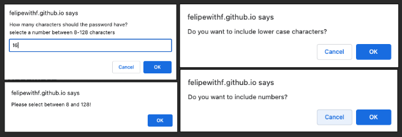
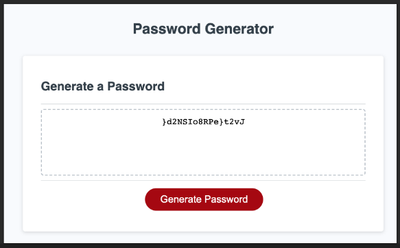

# Challenge3-Password Generator

Generate your own password with window prompts

## Description

I modify a starter code to create an application that enables employees to generate random passwords based on criteria that they’ve selected. This app will run in the browser and will feature dynamically updated HTML and CSS powered by JavaScript code that you write. It will have a clean and polished, responsive user interface that adapts to multiple screen sizes, currently is using window alets, prompts and confirmations but in the future this will be upgraded to html UI.

## Environments
You can view the live project using this link https://felipewithf.github.io/challenge3-pswGenerator/

## Criteria

WHEN prompted for the length of the password
THEN I choose a length of at least 8 characters and no more than 128 characters
WHEN asked for character types to include in the password
THEN I confirm whether or not to include lowercase, uppercase, numeric, and/or special characters
WHEN I answer each prompt
THEN my input should be validated and at least one character type should be selected
WHEN all prompts are answered
THEN a password is generated that matches the selected criteria
WHEN the password is generated
THEN the password is either displayed in an alert or written to the page

Below you can find some of the screenshot for the criteria

## Credits
This was done as part of a coding challenge and completed within one day for around 4 hours total

## License
MIT

## Tests
Feel free to test using different length of password, including less than 8 or higher than 128 to see alert window. 

Also test by declining lowercase and uppercase and only making password with numbers and special characters, they look cool!
